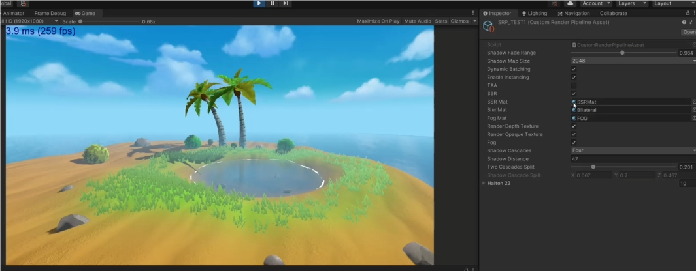

# 数字作品集
## 解密小游戏
**独自完成** 
**工具: Unity Blender. 语言: C# HLSL** 
**奖项: 校内创意玩法奖** 
 
在游戏内，你可以把方块扔进门里，它会从另一扇门弹出 
并且，这种机制可用于伪造非欧几里德空间 
更多关于我的游戏，您可以观看[演示视频](gamedemo.mp4) 
## 软渲染器
**独自完成** 
**工具: Visual Studio Code. 语言: JAVA** 
[演示视频](softRender1.mp4) 
 
这个渲染器实现了一些常用的渲染管线操作，包括MVP变换，齐次空间裁剪，透视插值矫正等 
实现的主要视觉效果包括透视校正过的UV纹理映射和简单的diffuse光照模型 
## 双人联机贪吃蛇小游戏
**独自完成** 
**语言: C++** 
 
使用c++在Ubuntu的控制台实现的基于TCP联机的贪吃蛇小游戏，两条蛇共用一张图和图中的道具 
使用帧同步模式，服务端只用于转发数据，双方只有在接收到对方的操作以后，才能进行下一帧  
## 一些场景的制作，以及基于SRP实现了一些经典的算法
**语言: C# HLSL** 
[演示视频](Stylized Island.mp4) 
 
首先搭建了一个风格化的小岛，其次如图中右边所示，实现了TAA，SSR等经典的算法

